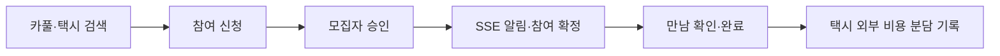

<div align="center">

# 🌿 모아 — Frontend

**같은 방향으로 가는 사람을 연결하는 출퇴근 카풀·택시 동승 서비스**


</div>

## 🧭 이용 흐름



| 기능 | 현재 구현 |
| --- | --- |
| 모집 검색 | `CARPOOL`·`TAXI`, 출발지·목적지 주변 반경, 날짜, 출발 시각순 더보기 |
| 모집·신청 | 모집 등록·수정·마감, 참여 신청·취소, 모집자의 승인·거절, 내 동행 조회 |
| 만남 | 출발 30분 전부터 만남 확인, 출발 시각부터 불참 기록, 상태 확정 후 완료 |
| 실시간 알림 | Bearer 인증 SSE, 미확인 배지, 읽음 처리, 알림에서 동행 상세 열기 |
| 만남 위치 | 동의한 참가자만 제한된 시간에 공유, 모집자·참가자별 조회 범위, 만료 위치 제거 |
| 택시 비용 | 만남 완료 후 실제 탑승자 분담금, 외부 수금 확인·취소 및 변경 이력 |
| 계정 | 회원가입·로그인, 프로필, 운전자 등록, 로그아웃·탈퇴 |

택시 호출·결제·송금 기능은 제공하지 않습니다. 실제 지출과 외부에서 받은 금액을 기록합니다.

## 🚀 로컬 실행

Node.js **22**와 `http://localhost:18080`에서 실행 중인 모아 백엔드가 필요합니다.

```bash
npm ci
npm test
npm run build
npm run dev
```

- 화면: **http://localhost:5173**
- Vite가 `/api`와 `/ws`를 백엔드 **localhost:18080**으로 전달합니다.
- 새 UI는 Leaflet·OpenStreetMap을 사용하며, 로컬 실행에 필요한 지도 API 키는 없습니다.
- `.env.example`의 Kakao 키와 `VITE_WS_BASE`는 구형 화면용입니다. `VITE_API_BASE`는 별도 API 주소를 사용할 때만 설정합니다.

> `npm run mock`과 `vite.mocks.js`는 구형 API 기준으로 남겨 둔 도구입니다.
> 신규 모아 화면의 통합 검증에는 사용할 수 없습니다. 실제 백엔드에 연결해 확인하세요.

## 🧩 코드 구조

| 경로 | 역할 |
| --- | --- |
| `src/main.jsx` · `src/app/App.jsx` | 앱 진입, 화면 전환, 인증 세션과 동행 상세 연결 |
| `src/api/client.js` | 인증 요청, 토큰 갱신, 계정 변경 시 오래된 응답 차단 |
| `src/features/discovery/` | 이동 수단·장소·날짜 검색과 모집 카드 |
| `src/features/recruitment/` | 모집 편집과 내가 모집·신청한 동행 |
| `src/features/trips/` | 신청 관리, 만남, 위치 공유, 택시 비용 |
| `src/features/notifications/` | SSE 파서·연결 수명 관리, DB 알림함 보정과 읽음 상태 |
| `src/features/auth/` · `src/features/account/` | 로그인·회원가입, 프로필·운전자·탈퇴 |
| `src/features/shared/` · `src/features/shell/` | 지도·장소 선택·대화상자 등 공통 UI와 앱 탐색 |
| `src/styles/moa.css` | 현재 모아 화면의 반응형 스타일 |
| `src/legacy/` | 구형 App·CSS 보존본. 현재 진입점에서는 사용하지 않음 |

React 18, React Router 7, Vite 6, Leaflet·React Leaflet을 사용합니다.
알림은 SSE, 만남 위치는 별도 STOMP WebSocket 채널로 처리합니다.
구형 `components/`, `hooks/`와 일부 API 모듈은 레거시 의존성으로 남아 있습니다.

## 🔔 알림 복구 방식

서버의 Redis Pub/Sub 이벤트를 각 API의 SSE 연결로 수신합니다.
연결 중단으로 놓친 알림은 초기 진입·재연결·탭 복귀와 활성 탭의 30초 주기 DB 조회로 보정합니다.
알림 ID로 중복을 제거하며, 비활성 탭·로그아웃·화면 해제 시 연결을 정리합니다.
전송 계층이 모든 이벤트의 수신을 보장한다고 가정하지 않습니다.

## ✅ 검증 범위

| 구분 | 확인 결과 |
| --- | --- |
| 자동 테스트 | Node 22에서 `node:test` **40개 통과**: 인증 경합, SSE 파싱·연결 정리, 알림 누락 복구, 위치 상태·채널 수명 |
| 빌드 | Vite 6 프로덕션 빌드 성공 |
| 실제 브라우저 | 로그인·신청·모집자 승인 버튼, 정원 0/3→1/3 및 참가자 목록 반영, SSE 수신·읽음, 만남 완료·택시비 분담, 가짜 좌표 공유·중지, 등록·검색·모바일 화면 |
| CI 구성 | GitHub PR·push마다 Node 22의 `npm ci`, `npm test`, `npm run build` 실행. 배포 단계 없음 |
| 부하 테스트 | 이번 작업에서는 실행하지 않음. 테스트 통과를 DAU·처리량 검증으로 해석하지 않음 |

테스트 계정·일부 신청 데이터는 로컬 API로 준비했습니다. 자동 테스트는 브라우저 전체 E2E 테스트가 아니며, 실기기 GPS 이동·권한 팝업은 검증하지 않았습니다.

---

**Techeer 2026 Team-C**
